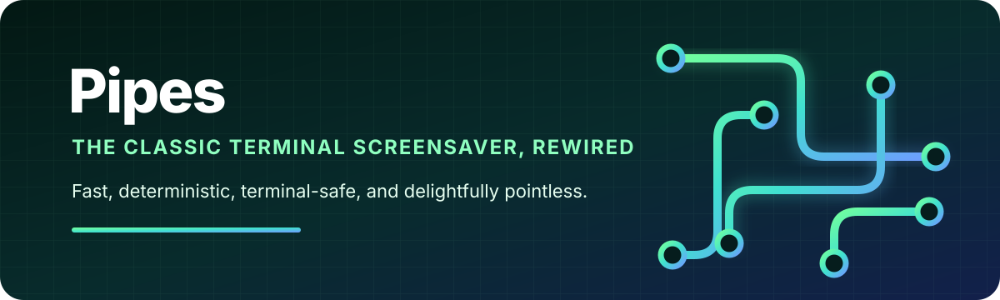

<p align="center">
  
</p>

<p align="center">
  <a href="https://github.com/madebycli/Pipes/actions/workflows/ci.yml"></a>
  
  
  
</p>

<p align="center">
  Animated terminal pipes with deterministic motion, rich color, and reliable cleanup.
</p>

**Pipes** is an independently maintained Python rewrite of the classic [`pipes.sh`](https://github.com/pipeseroni/pipes.sh) terminal screensaver. The familiar endless animation remains, while the runtime is rebuilt around a testable model, direct terminfo rendering, and one clean public command:

```bash
pipes
```

## Quick start

Run with Nix:

```bash
nix run github:madebycli/Pipes
```

Run directly from a checkout:

```bash
python3 pipes_sh.py
```

Install into the current Nix profile:

```bash
nix profile add github:madebycli/Pipes#pipes
pipes --self-test
pipes
```

Press any unassigned key to exit.

## Highlights

- Single-file Python runtime
- No runtime subprocesses, shell commands, network access, or persistent files
- Safe terminal restoration after normal exits, signals, errors, and broken pipes
- Deterministic animation through `--seed`
- Classic, 256-color, and direct-color terminal support
- Ten built-in pipe styles plus custom 16-glyph transition sets
- Live keyboard controls for speed, direction bias, color, and bold output
- Nix, Python wheel, Arch Linux, and Fedora packaging

## Usage

```text
pipes [OPTION]...

-p N                  number of pipes
-t 0-9                built-in pipe style; repeatable
-t c[16 chars]        custom pipe style; repeatable
-c INDEX              terminal color index; repeatable
-c #[HEX]             hexadecimal color index; repeatable
-f 20-100             frame rate
-s 5-15               straight-line probability denominator
-r N                  clear after N characters; 0 disables clearing
-R                    random starting positions and directions
-B                    disable bold
-C                    disable color
-K                    keep type and color when crossing edges
    --seed INTEGER    deterministic random seed
    --self-test       run non-interactive integrity checks
-v, --version         print the version
-h, --help            show help
```

Examples:

```bash
pipes
pipes -p 8 -t 0 -t 8 -r 0
pipes -c 33 -c 39 -c 45 -p 3
pipes -t cMAYFORCEBWITHYOU --seed 42
```

## Controls

| Key | Action |
|:---:|---|
| `P` / `O` | Increase / decrease straight-line tendency |
| `F` / `D` | Increase / decrease frame rate |
| `B` | Toggle bold output |
| `C` | Toggle color output |
| `K` | Toggle style and color retention across edges |
| any other key | Exit |

## Built-in styles

| Type | Style |
|---:|---|
| `0` | Heavy box |
| `1` | Light arc |
| `2` | Light square |
| `3` | Double box |
| `4` | ASCII plus |
| `5` | ASCII slash |
| `6` | Dots |
| `7` | Dot and O |
| `8` | Railway |
| `9` | Knobby |

A custom style begins with `c` and contains exactly 16 printable, single-cell characters:

```bash
pipes -t cMAYFORCEBWITHYOU
```

## NixOS

```nix
{
  inputs.pipes.url = "github:madebycli/Pipes";

  environment.systemPackages = [
    inputs.pipes.packages.${pkgs.system}.pipes
  ];
}
```

The flake supports `x86_64-linux` and `aarch64-linux` and exports packages, apps, checks, and a development shell.

## Python wheel

```bash
python3 -m build --wheel --no-isolation
python3 -m pip install dist/*.whl
pipes --version
```

The distribution is named `pipes-sh-python`; the installed command is `pipes`.

## Distribution packages

### Arch Linux

```bash
cd packaging/arch
makepkg --syncdeps --cleanbuild
sudo pacman -U ./pipes-sh-python-*.pkg.tar.zst
```

### Fedora

The RPM recipe is available at [`packaging/fedora/pipes-sh-python.spec`](packaging/fedora/pipes-sh-python.spec).

## Development

```bash
nix develop
make test
python3 scripts/benchmark.py
python3 -m build --wheel --no-isolation
nix flake check --print-build-logs
nix build .#pipes --print-build-logs
```

The automated test matrix covers deterministic model runs, rendering, resize behavior, signals, terminal mode restoration, wheel installation, Nix builds, Arch packages, and Fedora RPMs.

## Origins and license

The original program was created by [Matthew Simpson](https://gist.github.com/msimpson/1096939), later developed by [Yu-Jie Lin](https://github.com/livibetter), and maintained by the [Pipeseroni contributors](https://github.com/pipeseroni/pipes.sh/graphs/contributors).

This rewrite is independently maintained by [`madebycli`](https://github.com/madebycli) and is not an official Pipeseroni release. The historical MIT license and copyright notices remain preserved in [`LICENSE`](LICENSE).
